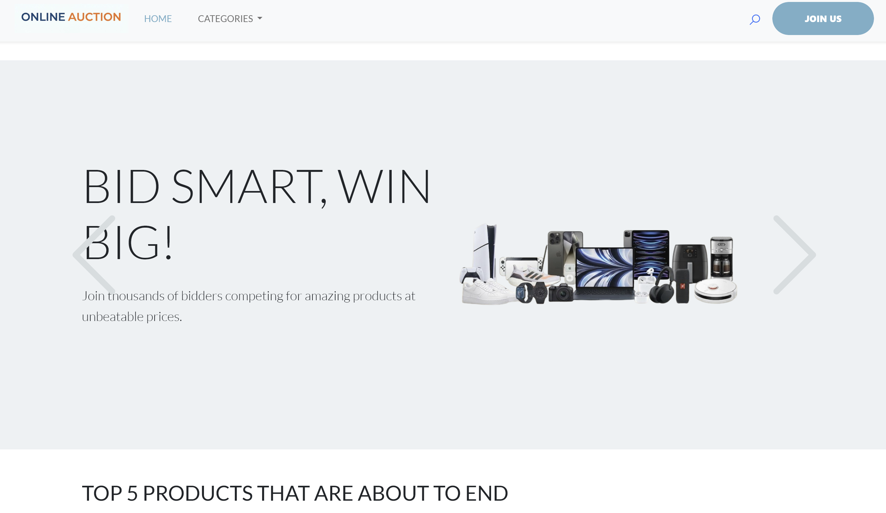
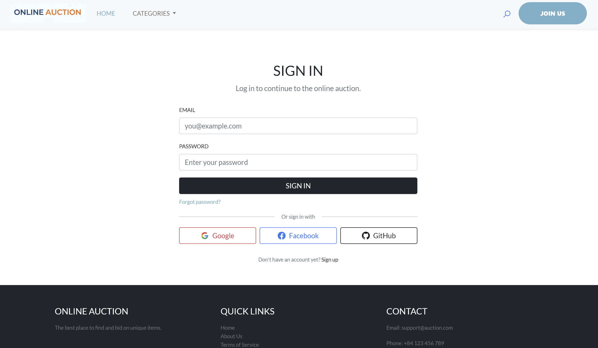
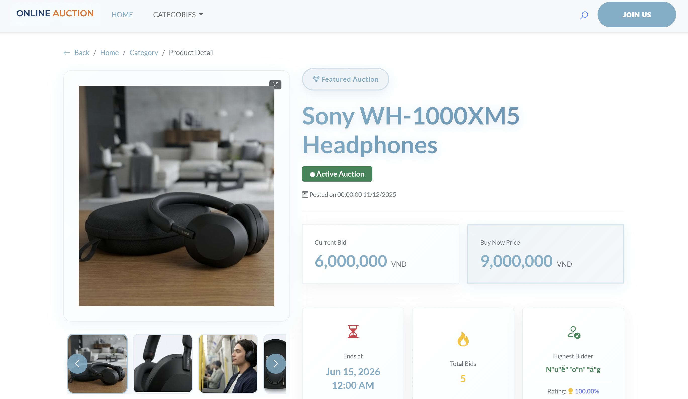
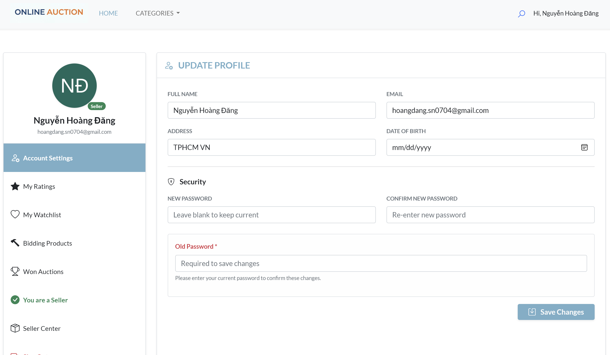

# Online Auction Platform

A full-stack web application for conducting real-time online auctions with automatic bidding capabilities. Built with Node.js, Express, and PostgreSQL, featuring server-side rendering with Handlebars and dynamic client-side DOM manipulation.

## Overview

This project implements a comprehensive online auction system that allows users to buy and sell items through a competitive bidding process. The platform supports multiple user roles (bidders, sellers, and administrators) with specific functionalities and permissions for each role.

## Platform Interface

### Screenshots

The application features a clean and intuitive interface across all sections:

#### Home Page
Displays featured auctions and top trending products ending soon with real-time auction countdowns


#### Authentication
Secure sign-in with email/password or OAuth providers (Google, Facebook, GitHub)


#### Product Details
Comprehensive product information including high-resolution images, bidding history, current price, and estimated end time


#### User Account
Profile management, bidding history, won auctions, watchlist, and seller center access


#### Seller Dashboard
Complete control over product listings with active, pending, expired, and sold product management

### Key Features

**Auction Management**
- Real-time auction listings with automatic price updates
- Automatic bidding system that allows users to set maximum bids
- Auction status tracking (active, pending, expired, sold)
- Automatic notifications when auctions end
- Product description updates for active auctions

**User System**
- User registration and authentication with multiple OAuth providers (Google, Facebook, GitHub)
- Password encryption using bcryptjs
- User profile management with address and contact information
- Seller registration and account upgrading
- Rating and review system for bidders and sellers

**Bidding Features**
- Real-time bid tracking and history
- Automatic bid increments based on current bid amount
- Anti-sniping mechanisms with auction extension
- Bid validation and conflict prevention
- Highest bidder tracking

**Seller Tools**
- Product listing creation with detailed descriptions and images
- Multiple image uploads per product
- Product description update system
- Sales dashboard and order management
- Inventory tracking for active, pending, and expired auctions

**Administrative Panel**
- Category management (CRUD operations)
- User account administration and suspension controls
- Product moderation and management
- System settings configuration
- Auction analytics and monitoring

**Order Management**
- Invoice generation and tracking
- Payment tracking with proof uploads
- Shipping management with proof documentation
- Order history and status updates
- Automatic order completion workflows

**Additional Features**
- Product search and category-based browsing
- Watchlist functionality for tracking items of interest
- Email notifications for auction events and updates
- Responsive design optimized for desktop and mobile
- Session management with secure authentication

## Technology Stack

**Backend**
- Node.js with Express.js framework
- PostgreSQL database with Knex.js query builder
- Passport.js for multi-strategy authentication
- Nodemailer for email notifications
- UUID for unique identifier generation

**Frontend**
- Handlebars as server-side templating engine
- Express Handlebars with custom helpers
- Vanilla JavaScript for client-side interactivity
- Bootstrap for responsive UI framework
- Multer for file upload handling
- SweetAlert2 for user notifications
- Quill Rich Text Editor for product descriptions

**Development Tools**
- Nodemon for automatic server restart during development
- Dotenv for environment variable management
- Method Override for HTTP method simulation

## Project Structure

```
ptudw-online-auction/
├── index.js                          # Main application entry point
├── package.json                      # Project dependencies
├── package-lock.json                 # Locked dependency versions
├── .env.example                      # Environment variables template
├── .gitignore                        # Git ignore configuration
│
├── routes/                           # Express route handlers
│   ├── home.route.js
│   ├── product.route.js
│   ├── account.route.js
│   ├── seller.route.js
│   └── admin/
│       ├── account.route.js
│       ├── category.route.js
│       ├── product.route.js
│       ├── system.route.js
│       └── user.route.js
│
├── models/                           # Database models (queries and logic)
│   ├── user.model.js
│   ├── product.model.js
│   ├── biddingHistory.model.js
│   ├── autoBidding.model.js
│   ├── invoice.model.js
│   ├── order.model.js
│   ├── orderChat.model.js
│   ├── category.model.js
│   ├── productComment.model.js
│   ├── productDescriptionUpdate.model.js
│   ├── rejectedBidder.model.js
│   ├── review.model.js
│   ├── watchlist.model.js
│   ├── upgradeRequest.model.js
│   └── systemSetting.model.js
│
├── views/                            # Handlebars templates
│   ├── layouts/
│   │   └── main.handlebars          # Main layout wrapper
│   ├── partials/
│   │   ├── header.handlebars
│   │   ├── footer.handlebars
│   │   ├── admin-sidebar.handlebars
│   │   ├── client-sidebar.handlebars
│   │   ├── seller-sidebar.handlebars
│   │   └── svg-icons.handlebars
│   ├── vwAccount/                   # User account pages
│   ├── vwAdmin/                     # Admin dashboard pages
│   ├── vwProduct/                   # Product listing and detail pages
│   ├── vwSeller/                    # Seller management pages
│   ├── home.handlebars
│   ├── 403.handlebars               # Forbidden page
│   └── 404.handlebars               # Not found page
│
├── public/                           # Static assets (CSS, JS, images)
│   ├── css/                          # Stylesheets
│   │   ├── bootstrap.min.css
│   │   ├── main.css
│   │   └── account/
│   ├── js/                           # Client-side scripts
│   │   ├── jquery-1.11.0.min.js
│   │   ├── bootstrap.bundle.min.js
│   │   └── script.js
│   ├── images/                       # Static images
│   └── uploads/                      # User uploads (products, shipping proofs)
│
├── middlewares/                      # Express middlewares
│   └── auth.mdw.js                   # Authentication and authorization
│
├── utils/                            # Utility functions
│   ├── db.js                         # Database connection setup
│   ├── mailer.js                     # Email sending utility
│   └── passport.js                   # OAuth authentication strategies
│
├── db/                               # Database initialization scripts
│   ├── create-table.sql              # Create all database tables and schemas
│   ├── insert-data.sql               # Insert sample/default data
│   ├── add-oauth-support.sql         # Add OAuth provider support tables
│   ├── mask-name.sql                 # Add name masking function
│   └── full-text-search.sql          # Configure full-text search indexes
│
├── scripts/                          # Scheduled/utility scripts
│   └── auctionEndNotifier.js         # Background job for auction end notifications
│
└── docs/                             # Documentation
    └── images/                       # Screenshot images for README
```

## Installation & Setup

### Prerequisites
- Node.js (v16 or higher)
- PostgreSQL database
- npm package manager

### Steps

1. Clone the repository
   ```bash
   git clone https://github.com/danzgne/ptudw-online-auction.git
   cd ptudw-online-auction
   ```

2. Install dependencies
   ```bash
   npm install
   ```

3. Set up environment variables
   - Copy `.env.example` to `.env`
     ```bash
     cp .env.example .env
     ```
   - Update the `.env` file with your actual configuration values:
     - Email configuration (SMTP credentials for notifications)
     - reCAPTCHA keys
     - OAuth provider credentials (Google, Facebook, GitHub, Twitter)
   
   **Note:** The `.env` file is ignored by Git and should never be committed.

4. Configure database connection
   You have two options for database setup:
   
   **Option A: Use the project's existing database (Recommended for quick start)**
   - The database connection is already configured in `utils/db.js` with a working PostgreSQL instance
   - Simply proceed to step 5 to start the development server
   - This uses the author's hosted database configuration
   
   **Option B: Set up your own PostgreSQL database**
   - PostgreSQL must be installed and running on your system
   - Create a new PostgreSQL database for the project
   - Execute the database initialization scripts in `db/` folder in the following order:
     
     1. **create-table.sql** - Creates all database tables and schemas
     2. **insert-data.sql** - Inserts sample/default data (categories, system settings)
     3. **add-oauth-support.sql** - Configures OAuth provider support
     4. **mask-name.sql** - Adds the name masking function for privacy
     5. **full-text-search.sql** - Sets up full-text search indexes for better performance
   
   - After running the scripts, update the connection configuration in `utils/db.js`:
     ```javascript
     connection: {
       host: 'your_database_host',
       port: 5432,
       user: 'your_database_user',
       password: 'your_database_password',
       database: 'your_database_name'
     }
     ```

5. Start development server
   ```bash
   npm run dev
   ```

6. Access the application
   - Home page: `http://localhost:3005`
   - Admin panel: `http://localhost:3005/admin` (requires admin privileges)

## Usage

### For Bidders
- Browse available auctions by category
- Place bids on products
- Set up automatic bidding with maximum bid amounts
- View bidding history and track auction progress
- Win auctions and complete payment process
- Leave reviews and ratings for sellers

### For Sellers
- Create product listings with detailed descriptions
- Upload product images
- Set starting prices and auction duration
- Monitor active auctions and received bids
- Update product descriptions during active auctions
- Complete orders and manage shipping
- View sales dashboard and receive customer reviews

### For Administrators
- Manage product categories
- Moderate product listings
- Manage user accounts and suspend problematic users
- Configure system settings
- View platform analytics and auction statistics

## Important Notes

> **⚠️ DISCLAIMER - EDUCATIONAL PROJECT ONLY**
>
> This project is developed strictly for academic and educational purposes as part of HCMUS Web Development course. It is designed to demonstrate full-stack web development concepts and should NOT be used for any commercial purposes.

### Educational Focus
This platform serves as a learning tool that demonstrates:
- Server-side rendering with template engines (Handlebars)
- Client-side DOM manipulation and interactivity
- Real-time data updates and notifications
- Multi-role user authorization and access control
- Relational database design and querying
- RESTful API design patterns
- Authentication and security practices
- File upload and image management
- Email notification systems

### Important Disclaimer
**This platform is NOT intended for:**
- Commercial use or business operations
- Profit generation or monetary transactions
- Real auction or bidding activities
- Any financial or transactional purposes

**Regarding Content:**
- Product images used in the application are sourced from the internet for demonstration purposes only
- All content is used strictly for educational and demonstration purposes
- This is a learning project to showcase web development capabilities

### Usage Rights
This project is provided as-is for educational purposes. Users must ensure compliance with all applicable laws and regulations when deploying or using any code from this project.

## License

This project is licensed under the ISC License. See LICENSE file for details.

## Author

Developed as part of HCMUS Web Development course (Semester 1)

---

For questions or contributions, please visit the [GitHub repository](https://github.com/danzgne/ptudw-online-auction).

